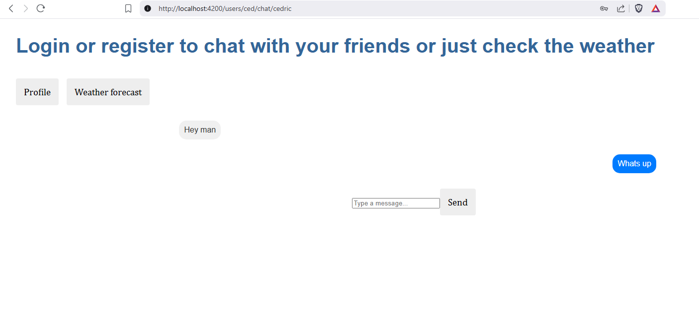

# webchat
This is a project that I made in my free time during the summer of 2023, it is not optimized at all.
I just wanted to experiment a bit to train overall skills.

For the frontend I used angular.
The backend is written in python/Flask, it handles database requests.
There also is a small part of server and client side code that i wrote in node.js,
it is made to update the chat in real time when multiple users are active.

## Landing page (after clicking login button)
Here you can create a new account or login.


## Logged in
This page allows you to enter a chat or make new friends!


## Chat
Very simple chatting interface for you to converse with a friend.


## Weather
In case you want to know the weather (the api expects english names).


## How to run it yourself:
Make sure you have angular, npm, python and sqlite (can be installed via python, package name is sqlite3)

Open a command prompt or shell and navigate to flask-backend, optionally create a virtual environment.
```bash
pip install -r requirements.txt
python database-api.py
```

In a new command prompt or shell, navigate to frontend.
```bash
npm install
ng serve
```